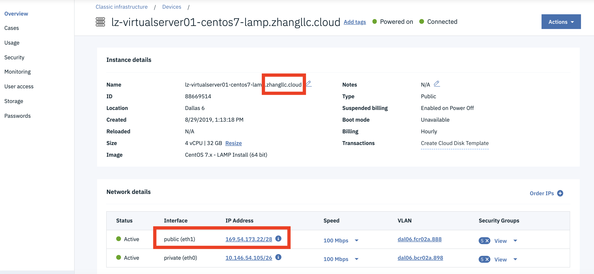
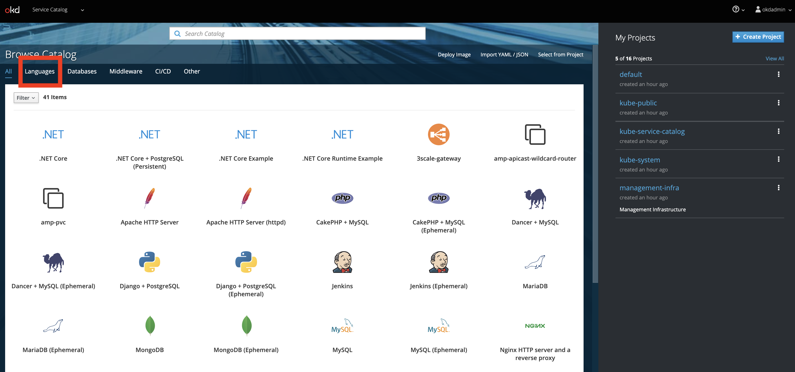
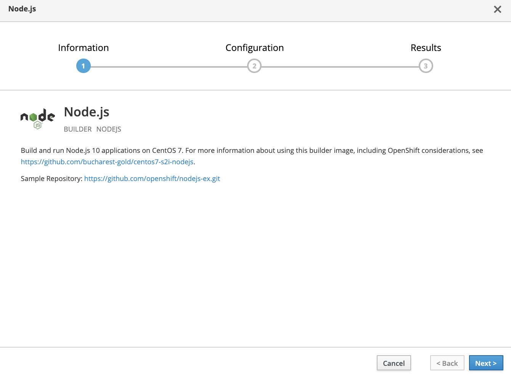

# Provision OKD v3.11 on centOS v7.x in IBM Cloud (SoftLayer)

OKD, “the Origin Community Distribution of Kubernetes that powers Red Hat OpenShift”. It's the open source version of OpenShift. 

OpenShift Enterprise is a product offered and supported by Red Hat.

This repo introduces an efficient and economic alternative to host an OKD/OpenShift v3.11 environment in IBM Cloud (SoftLayer). The procedure can be applied to a local machine if your machine had enough resources to host an OKD environment. 

This repository is a set of scripts that will allow you easily install the latest version (3.11) of OKD in a single node fashion.  What that means is that all of the services required for OKD to function (master, node, etcd, etc.) will all be installed on a single host.  

A single node OKD/OpenShift environment is intended for development, testing and education purpose. A single node, fully functioning OKD environment running in IBM Cloud can cost as low as only 25 cents per hour.

MiniShift and CDK are other alternatives to have a local OpenShift environment.  This deployment method is targeted for a single node cluster that has a long life.


## Pre-requisites

* A clean CentOS system
    * the procedure installs all necesary tools and packages including Ansible, container runtime, etc.
    * The procedure in the repo is intended for CentOS v7.x


## Limitation

> **Warning about Let's Encrypt setup available on this project:**
* Let's Encrypt only works if the IP is using publicly accessible IP and custom certificates.
* This feature doesn't work with OpenShift CLI for now.


## Provision Virtual Server in IBM Cloud (SoftLayer)

You need a clean machine with CentOS Linux for OKD deployment. To provision a virtual server instance in IBM Cloud (SoftLayer),

1. Login to [IBM Cloud console](https://cloud.ibm.com).

1. Select `Catalog` on the top.

1. Select `Compute` on the left.

1. Select `Virtual Server` in the section `Infrastructure`.

    

1. Choose a machine category. A `Public Virtual Server` instance should work fine for the most of cases. But, it's your option to choose.

1. Click `Continue`.

1. Select machine settings. Feel free to choose your settings per your requirements. Settings below are what have been verified working.

    * `Type of virtual server`: `Public`
    * `Hostname`: a unique hostname
    * `Domain`: if the default domain name contains upper case, you may consider to change all to lower case
    * `Location`: based on your location
    * `Popular profiles`: `Memory M1.4x32`
    * `Image`: `CentOS 7.x - LAMP (64 bit)` 
    * `Attached storage disks`: 100GB
    * `Private security group`: select all 5 options
    * `Public security group`: select all 5 options.

    > **Note: `CentOS 7.x - LAMP (64 bit)` must be the Linux OS for the deployment. The deployment automation in the repo is only intended for `CentOS 7.x - LAMP (64 bit)`.**

    

    

1. Select the checkbox `I read and agree to the following Third-Party Service Agreements: 3rd Party Software Terms CentOS`.

1. `Create`.


## Collect Information of the Virtual Server Instance

It may take a few minutes for your virtual server provisioning to be completed. A few information from your virtual server instance should be collected before deploying OKD.

1. Login to [IBM Cloud](https://cloud.ibm.com).

1. Click the `Navigation Menu` on the top-left.

1. Select `Resource List`.

1. Expand `Devices` section in the right pane.

1. Locate and click your virtual server instance.

    

1. In the `Overview` tab, take note of the domain of your virtual server. For example, `zhang-llc.cloud` in the screen shot below.

    

1. Scroll down to tne `Network` section and Take note of the `Public IP address`.

1. Select the `Passwords` tab in the left pane.

1. Make the password of root user available and take note of it.

    


## Prepare OKD v3.11 Deployment

A few house-keeping tasks are necessary to prepare the OKD deployment.

1. Open a `Terminal` window.

1. Connect to your virtual server instance.

    ```
    ssh root@<your server public IP>
    ```

1. Follow the prompts to logon to your virtual server.

1. Make sure your virtual server has the latest software.

    ```
    yum update
    ```

1. Install Git

    You need Git CLI tool to clone repo from Github.

    ```
    yum install git
    ```

1. Create New User

    Create user `okdadmin` whom you use to login to OpenShift console after OKD/OpenShift is deployed.

    ```
    adduser -m okdadmin -s /bin/bash
    passwd okdadmin
    ```

1. Clone the Git Reop

    The repo provides automation scripts to simplify OKD deployment.

    ```
    cd /tmp
    mkdir openshift311
    cd openshift311

    git clone https://github.com/lee-zhg/installcentos
    cd /tmp/openshift311/installcentos
    ```


## Deploy OKD v3.11

Now, you are ready to deploy OKD environment.

1. Deploy OKD v3.11

    ```
    ./install-openshift.sh
    ```

1. The installation script collects couple of information before the OKD deployment starts.

    * `Domain to us` - You may accept the default or replace `nip.io` with the domain of your virtual server, for example `169.54.241.194.zhang-llc.cloud`.

    * `Username: (root)` - You may accept the default or enter a different username, for example `okdadmin`.

    * `Password: (password)` - The default is `password`. You are setting the password for the username above.

    * `OpenShift Version: (3.11)` - Accept the default.

    * `IP: (169.54.241.194)` - Accept the default. This is the public IP address of your virtual server.

    * `API Port: (8443)` - Accept the default. Port `8443` is used to access OKD console.

    * `Do you wish to enable HTTPS with Let's Encrypt?` - This feature works in certain circumstances. Make your selection.

    ```
    ******
    * Your domain is 169.54.241.206.nip.io 
    * Your IP is 169.54.241.206 
    * Your username is okdadmin 
    * Your password is password 
    * OpenShift version: 3.11 
    * Enable HTTPS with Let's Encrypt: false 
    ******
    ```

1. The deployment starts the ansible playbook and takes about 20-30 minutes to complete.

1. When the deployment completes successfully, you should see similar information below.

    ```
    ******
    * Your console is https://console.169.54.241.206.nip.io:8443
    * Your username is okdadmin 
    * Your password is Tivoli12 
    *
    * Login using:
    *
    $ oc login -u okdadmin -p Tivoli12 https://console.169.54.241.206.nip.io:8443/
    ******
    Login successful.

    You have access to the following projects and can switch between them with 'oc project <projectname>':

    * default
      kube-public
      kube-service-catalog
      kube-system
      management-infra
      openshift
      openshift-console
      openshift-infra
      openshift-logging
      openshift-metrics-server
      openshift-monitoring
      openshift-node
      openshift-sdn
      openshift-template-service-broker
      openshift-web-console

    Using project "default".

    ```

1. Take a note of your console url, for example `https://console.169.54.241.206.nip.io:8443`. You'll need the link for later.


## Verification

To verify your OKD/OpenShift environment,

1. In the same `terminal` window, execute OKD/OpenShift command

    ```
    oc new-project my-project

    Now using project "my-project" on server "https://console.169.54.241.206.nip.io:8443".
    You can add applications to this project with the 'new-app' command. For example, try:
        oc new-app centos/ruby-25-centos7~https://github.com/sclorg/ruby-ex.git
    to build a new example application in Ruby.
    ```

1. A new project `my-project` is created.

1. Execute command `oc projects` to all available projects on your system

    ```
    oc projects

    You have access to the following projects and can switch between them with 'oc project <projectname>':

        default
        kube-public
        kube-service-catalog
        kube-system
        management-infra
      * my-project
        openshift
        openshift-console
        openshift-infra
        openshift-logging
        openshift-metrics-server
        openshift-monitoring
        openshift-node
        openshift-sdn
        openshift-template-service-broker
        openshift-web-console

    Using project "my-project" on server "https://console.169.54.241.206.nip.io:8443".
    ```


## Explore OKD/OpenShift

Now, your OKD/OpenShift environment is deployed and verified. This section shows basic development and operation steps in OpenShift console.

1. Open the OKD console with the above console url in a browser.

1. Login to the console with the username choosen during the OKD deployment, for example `okdadmin`.

1. OKD/OpenShift home page is displayed.

    

1. Select `Languages` in the top-left corner.

    

1. Select `JavaScript` and then `Node.js`.

1. The `Node.js` application window is displayed.

    

1. Click `Next`.

1. Now, you define how you want to deploy your node.js application.

    * `Add to Project` - select `my-project` from the list. Remember you create the project in the previous section.

    * `Application Name` - give an application name, for example `my-node-app`

    * `Git Repository` - click the `Try Sample Repository ` link to populate the field

    

1. Click `Create`.

    

1. The application is created and its deployment is started.

1. Click the `Continue to the project overview` link.

    

1. The `Deplyment Config my-node-app, #1` is shown under the `Application my-node-app` which is in the `Project my-project`.

1. Expand the `Deployment Config my-node-app, #1`.

    > Note, don't click the `Deployment Config my-node-app, #1` link.

    

1. Click the link on the page to access your application. The link is displayed in couple of places shown above.

    

1. With a few clicks, you have successfully deployed a sample Node.js application to your OKD/OpenShift environment running in IBM Cloud.


## Acknowledgement

The instructions were adapted from the repo found here - https://github.com/gshipley/installcentos.git.

