# Provision OKD v3.11 on centOS v7.x in IBM Cloud (SoftLayer)

OKD, “the Origin Community Distribution of Kubernetes that powers Red Hat OpenShift”. It's the open source version of OpenShift. 

OpenShift Enterprise is a product offered and supported by Red Hat.

This repo introduces an efficient and economic alternative to host an OKD/OpenShift v3.11 environment in IBM Cloud (SoftLayer). The procedure can be applied to a local machine if your machine had enough resources to host an OKD environment. 

This repository is a set of scripts that will allow you easily install the latest version (3.11) of OKD in a single node fashion.  What that means is that all of the services required for OKD to function (master, node, etcd, etc.) will all be installed on a single host.  

A single node OKD/OpenShift environment is intended for development, testing and education purpose. A single node, fully functioning OKD environment running in IBM Cloud can cost as low as only 25 cents per hour.

MiniShift and CDK are other alternatives to have a local OpenShift environment.  This deployment method is targeted for a single node cluster that has a long life.


## Pre-requisites

* Terraform

* IBM Cloud IaaS account

* IBM Cloud Infrastructure API key

* IaaS permissions to create and deploy servers, configure network interfaces

* A clean CentOS system
    * the procedure installs all necesary tools and packages including Ansible, container runtime, etc.
    * The procedure in the repo is intended for CentOS v7.x


## Limitation

> **Warning about Let's Encrypt setup available on this project:**
* Let's Encrypt only works if the IP is using publicly accessible IP and custom certificates.
* This feature doesn't work with OpenShift CLI for now.


## Install Terraform

To use terraform to manage IBM Cloud, it is necessary to install Terraform and the terraform-provider-ibm binaries.

Terraform is 'infrastructure as code' automation software by HashiCorp. It allows users to define (clloud) infrastructure in a high-level scripting language, which can be executed to build the infrastructure on the desired cloud platform.

Terraform is a tool for building cloud environments, the focus was IaaS, but it supports any service (PaaS or FaaS) that can be configured by an API , so includes database services, DNS, CDNs and many other resources. Terraform is open-source, its developer Hashicorp also offers a proprietry solution, though by itself the open-source solution offers a lot of value in automating environment builds using the idea of ‘infrastructure as code’, versioning and managing infrastructure in the same way that developers manage code. 

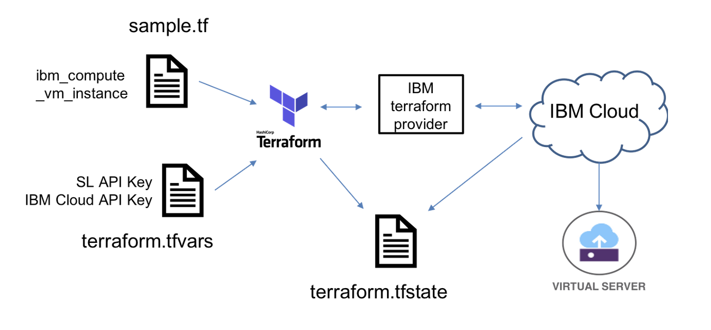

At the time of this writing, Terraform v0.11.x is supported for IBM Cloud. Terraform v0.11.12 is used to develop this repo. To install Terraform v0.11.12,

1. Create a temporary folder on your local machine.

    ```
    mkdir /tmp/terraform
    ```

1. Navigate to the new folder.

    ```
    cd /tmp/terraform
    ```

1. Download `Terraform v0.11.12` at `https://releases.hashicorp.com/terraform/0.11.12/` and place the downloaded file to the new folder.

1. Unpack the zip file.

1. Move file `terraform` to `/usr/local/bin`.

    ```
    mv /tmp/terraform/terraform  /usr/local/bin
    ```

1. verify the Terraform installation.

    ```
    terraform
    
    Usage: terraform [-version] [-help] <command> [args]
    The available commands for execution are listed below. The most common, useful commands are shown first,followed by less common or more advanced commands. If you're just getting started with Terraform, stick with the common commands. For the other commands, please read the help and docs before usage.  
    ```


## Install IBM Terraform Provider

To support a multi-cloud approach, Terraform works with providers. A provider is responsible for understanding API interactions and exposing resources. In this section, you will download and configure the IBM Cloud provider.

1. Navigate to the new folder created in the previous section.

    ```
    cd /tmp/terraform
    ```

1. Download the latest version of the `terraform-provider-ibm binary` at `https://github.com/IBM-Cloud/terraform-provider-ibm/releases`.

1. Unpack the zip file.

1. Move file `terraform-provider-ibm` to `/usr/local/bin`.

    ```
    mv /tmp/terraform/terraform-provider-ibm_v0.18.0  /usr/local/bin/terraform-provider-ibm
    ```

1. verify the `terraform-provider-ibm` installation.

    ```
    terraform-provider-ibm
    
    2019/09/04 14:56:27 IBM Cloud Provider version 0.17.2  
    This binary is a plugin. These are not meant to be executed directly.
    Please execute the program that consumes these plugins, which will
    load any plugins automatically
    ```


## Clone the Repo

1. Navigate to `/tmp` folder.

1. Clone the repo.

    ```
    git clone https://github.com/lee-zhg/install-OKD-centos7-ibmcloud/tree/master

    cd  install-OKD-centos7-ibmcloud
    ```
1. Create file `terraform.tfvars`

    ```
    cp  terraform.sample.tfvars  terraform.tfvars
    ```
1. Open file `terraform.tfvars` in your preferred file editor.


## Configure Terraform for IBM Cloud

Terraform communicates with the IBM Cloud via REST API. You must provide minimal connection information for Terraform to communicate with IBM Cloud.

* IBM IaaS Infrastructure full username
* IBM IaaS Infrastructure API key
* IBM Cloud API Key

1. login to `IBM SoftLayer Console` at `https://control.softlayer.com/`.

1. navigate to `Edit User Profile` at `https://control.softlayer.com/account/user/profile`.

1. Scroll down to the `API Access Information` section.

1. Assign the value of the `API Username` to `iaas_username` in the file `terraform.tfvars`. For example, `iaas_username = "SL######"`.

1. Assign the value of the `Authentication Key` to `ibmcloud_iaas_api_key` in the file `terraform.tfvars`. For example, `ibmcloud_iaas_api_key="AAAAAAAAAAAAAAAA##########"`.

1. Login to `IBM Cloud Console` at https://cloud.ibm.com.

1. Navigate to `IBM Cloud API Keys` at https://cloud.ibm.com/iam/apikeys.

1. Select `Create an IBM Cloud API key` and create a new API key.

1. Assign the new API key to `ibmcloud_api_key` in the file `terraform.tfvars`. For example, `ibmcloud_api_key="AAAAAAAAAAAAAAAA##########"`.

1. Save the file `terraform.tfvars`.


## Provision Virtual Server in IBM Cloud (SoftLayer)

As the size on complexity of cloud hosted applications grows’, manually buiding cloud infrastructure via a UI can become slow and error-prone. It is also not repeatable, limiting the ability to build development and test environments that match what will be used in production. 

Instructions are provided to providsion Virtual Server instance in IBM Cloud via Terraform in this section. To provision a virtual server instance in IBM Cloud (SoftLayer),

1. Open a `Terminal` window.

1. Navigate to the root folder of your repo foldser.

    ```
    cd  /tmp/install-OKD-centos7-ibmcloud
    ```

1. Initialize Terraform IBM plugin.

    ```
    terraform init

    Terraform has been successfully initialized!
    ```

1. Check if any change is required for your infrastructure. The command below compares the desired state and actual state of your infrastructure, and identify the differences.

    ```
    terraform plan
    ```

1. At the end of the output of command `terraform plan`, if everything goes well, you should see

    ```

    Plan: 1 to add, 0 to change, 0 to destroy.
    ```

1. If you envountered any error, you should resolve the problem before moving to the next step.

1. Provision a `Virtual Server` instance in IBM Cloud.

    ```
    terraform
    ```

1. When prompted `Do you want to perform these actions?`, reply `yes`.

1. The provisioning may take a while. It's good time for a coffee break.

1. Upon the provision completion, execute

    ```
    terraform show
    ```

    The command reads the `terraform.tfstate` file and displays information Terraform has recorded about the virtual server. 

1. Execute command

    ```
    terraform plan
    ```

    The last line of the command output should show

    ```
    Plan: 0 to add, 0 to change, 0 to destroy.
    ```

1. Command `terraform destroy` can remove your virtual server instance when you no longer need it.

    > **NOTE: don't execute command `terraform destroy` now.**


## Verify your Virtual Server Instance

1. Login to `IBM Cloud console` at `https://cloud.ibm.com`.

1. Navigate to `Devices` at `https://cloud.ibm.com/classic/devices`.

1. The new virtual server instance should show up on the list.


## Collect Information of the Virtual Server Instance

It may take a few minutes for your virtual server provisioning to be completed. A few information from your virtual server instance should be collected before deploying OKD.

1. Login to [IBM Cloud](https://cloud.ibm.com).

1. Click the `Navigation Menu` on the top-left.

1. Select `Resource List`.

1. Expand `Devices` section in the right pane.

1. Locate and click your virtual server instance.

    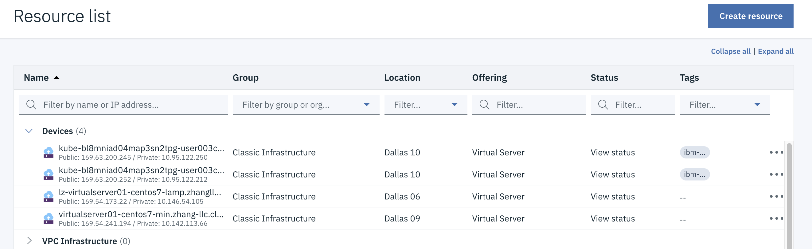

1. In the `Overview` tab, take note of the domain of your virtual server. For example, `zhang-llc.cloud` in the screen shot below.

    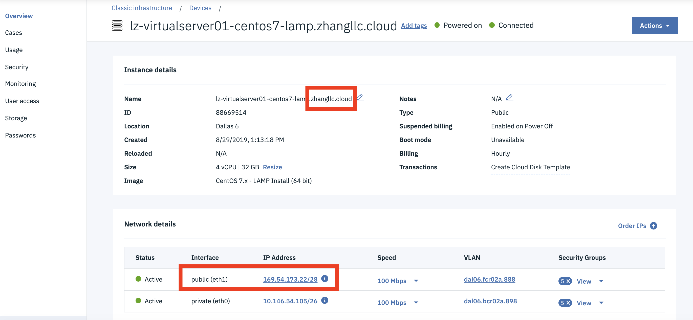

1. Scroll down to tne `Network` section and Take note of the `Public IP address`.

1. Select the `Passwords` tab in the left pane.

1. Make the password of root user available and take note of it.

    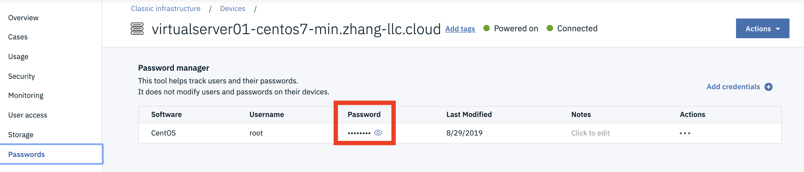


## Prepare OKD v3.11 Deployment

A few house-keeping tasks are necessary to prepare the OKD deployment.

1. Open a `Terminal` window.

1. Connect to your virtual server instance.

    ```
    ssh root@<your server public IP>
    ```

1. Follow the prompts to logon to your virtual server.

1. Make sure your virtual server has the latest software.

    ```
    yum update
    ```

1. Install Git

    You need Git CLI tool to clone repo from Github.

    ```
    yum install git
    ```

1. Create New User

    Create user `okdadmin` whom you use to login to OpenShift console after OKD/OpenShift is deployed.

    ```
    adduser -m okdadmin -s /bin/bash
    passwd okdadmin
    ```

1. Clone the Git Reop

    The repo provides automation scripts to simplify OKD deployment.

    ```
    cd /tmp
    mkdir openshift311
    cd openshift311

    git clone https://github.com/lee-zhg/installcentos
    cd /tmp/openshift311/installcentos
    ```


## Deploy OKD v3.11

Now, you are ready to deploy OKD environment.

1. Make sure you are login as `root` user in your terminal window.

1. Set parameters for running the automation script.

    * set variable `DOMAIN` used to access the cluster

        ```
        export DOMAIN=<public ip address>.nip.io
        ```

        For example, `export DOMAIN=169.54.241.206.nip.io`.

    * set variable `USERNAME` used to login to OpenShift console

        ```
        export USERNAME=okdadmin
        ```

    * set variable `PASSWORD` for the user `okdadmin`

        ```
        export PASSWORD=<password>
        ```

    * set variable `INTERACTIVE` for the user `okdadmin`

        ```
        export INTERACTIVE=false
        ```

1. Deploy OKD v3.11

    ```
    ./install-openshift.sh
    ```

1. When the automation script starts, it first displays all parameters used to execution. Below are sample contents. If your deployment failed for any reason, you may review its contents at the begining of the script log.

    ```
    ******
    * Your domain is 169.54.241.206.nip.io 
    * Your IP is 169.54.241.206 
    * Your username is okdadmin 
    * Your password is password 
    * OpenShift version: 3.11 
    * Enable HTTPS with Let's Encrypt: false 
    ******
    ```

1. The deployment starts the ansible playbook and may take a while to complete. It's good time for a coffee break.

1. When the deployment completes successfully, you should see similar information below.

    ```
    ******
    * Your console is https://console.169.54.241.206.nip.io:8443
    * Your username is okdadmin 
    * Your password is password
    *
    * Login using:
    *
    $ oc login -u okdadmin -p Tivoli12 https://console.169.54.241.206.nip.io:8443/
    ******
    Login successful.

    You have access to the following projects and can switch between them with 'oc project <projectname>':

    * default
      kube-public
      kube-service-catalog
      kube-system
      management-infra
      openshift
      openshift-console
      openshift-infra
      openshift-logging
      openshift-metrics-server
      openshift-monitoring
      openshift-node
      openshift-sdn
      openshift-template-service-broker
      openshift-web-console

    Using project "default".

    ```

1. Take a note of your console url, for example `https://console.169.54.241.206.nip.io:8443`. You'll need the link for steps below.


## Verification

To verify your OKD/OpenShift environment,

1. In the same `terminal` window, execute OKD/OpenShift command

    ```
    oc new-project my-project

    Now using project "my-project" on server "https://console.169.54.241.206.nip.io:8443".
    You can add applications to this project with the 'new-app' command. For example, try:
        oc new-app centos/ruby-25-centos7~https://github.com/sclorg/ruby-ex.git
    to build a new example application in Ruby.
    ```

1. A new project `my-project` is created.

1. Execute command `oc projects` to all available projects on your system

    ```
    oc projects

    You have access to the following projects and can switch between them with 'oc project <projectname>':

        default
        kube-public
        kube-service-catalog
        kube-system
        management-infra
      * my-project
        openshift
        openshift-console
        openshift-infra
        openshift-logging
        openshift-metrics-server
        openshift-monitoring
        openshift-node
        openshift-sdn
        openshift-template-service-broker
        openshift-web-console

    Using project "my-project" on server "https://console.169.54.241.206.nip.io:8443".
    ```


## Explore OKD/OpenShift

Now, your OKD/OpenShift environment is deployed and verified. This section shows basic development and operation steps in OpenShift console.

1. Open the OKD console with the above console url in a browser.

1. Login to the console with the username choosen during the OKD deployment, for example `okdadmin`.

1. OKD/OpenShift home page is displayed.

    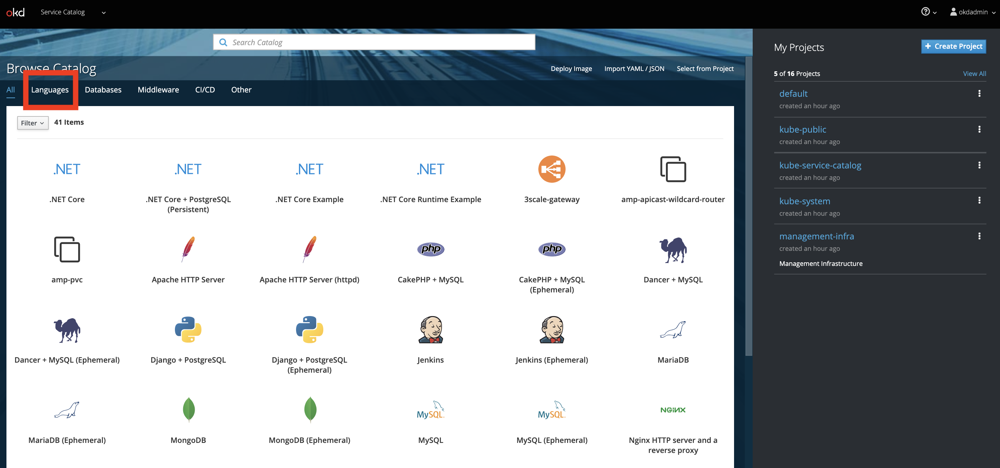

1. Select `Languages` in the top-left corner.

    

1. Select `JavaScript` and then `Node.js`.

1. The `Node.js` application window is displayed.

    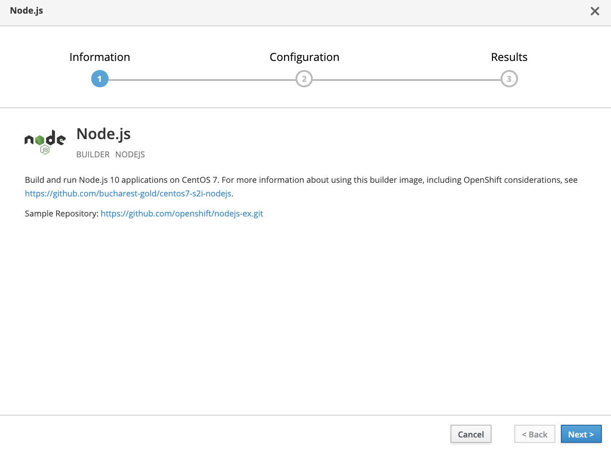

1. Click `Next`.

1. Now, you define how you want to deploy your node.js application.

    * `Add to Project` - select `my-project` from the list. Remember you create the project in the previous section.

    * `Application Name` - give an application name, for example `my-node-app`

    * `Git Repository` - click the `Try Sample Repository ` link to populate the field

    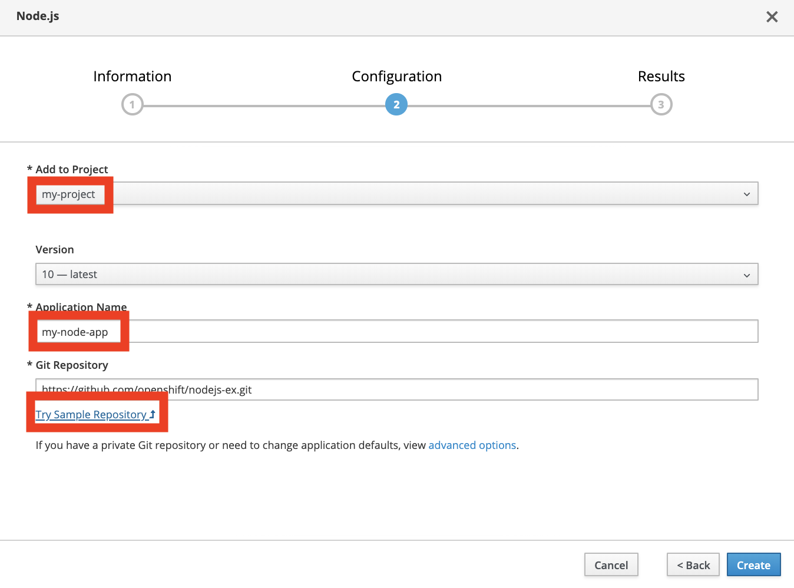

1. Click `Create`.

    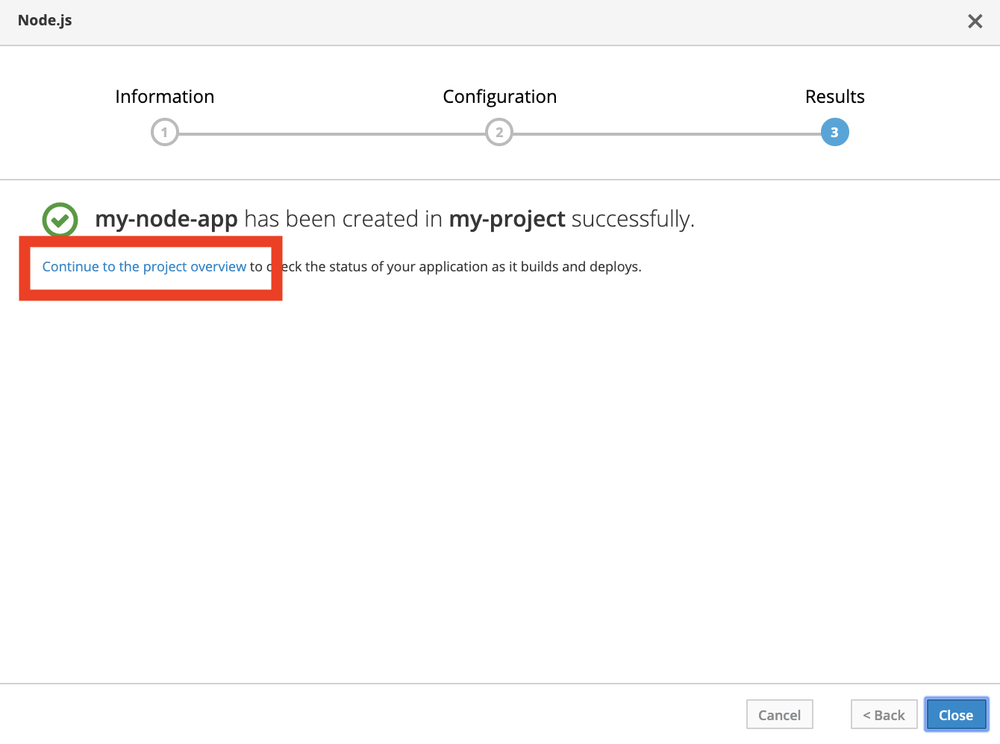

1. The application is created and its deployment is started.

1. Click the `Continue to the project overview` link.

    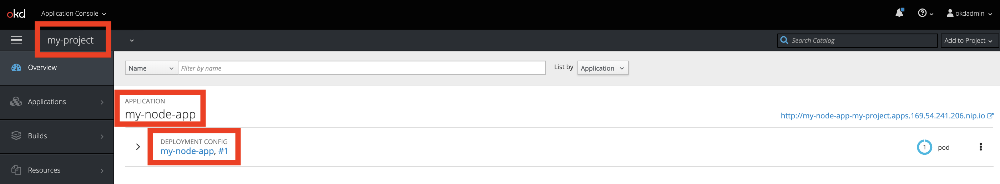

1. The `Deplyment Config my-node-app, #1` is shown under the `Application my-node-app` which is in the `Project my-project`.

1. Expand the `Deployment Config my-node-app, #1`.

    > Note, don't click the `Deployment Config my-node-app, #1` link.

    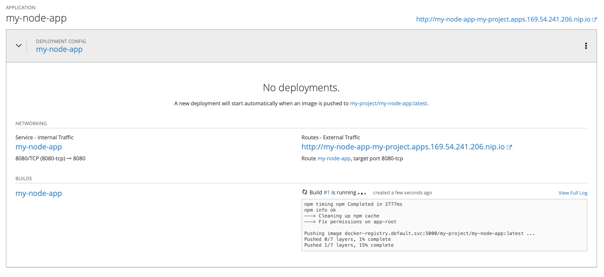

1. It can take a minute or two for the application deployment to complete. Eventually, the pod will be in `Running` state.

    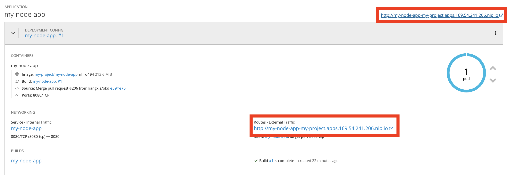

1. Click the link on the page to access your application. The link is displayed in couple of places shown above.

    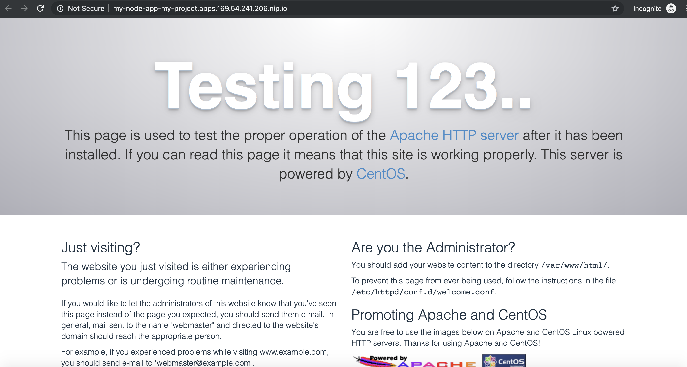

1. With a few clicks, you have successfully deployed a sample Node.js application to your OKD/OpenShift environment running in IBM Cloud.


## Reference

OKD - https://www.okd.io/
OpenShift - https://www.openshift.com/


## Acknowledgement

The instructions were adapted from the repo found here - https://github.com/gshipley/installcentos.git.

